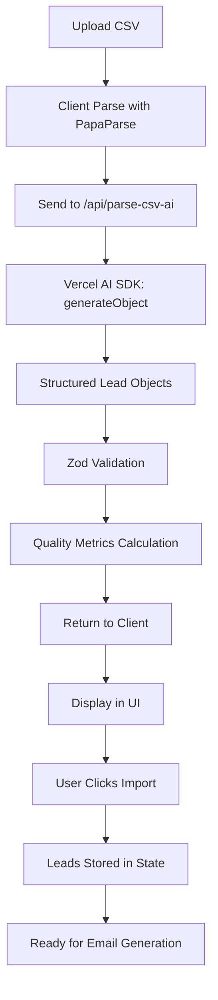

# Vercel AI SDK CSV Parser - Complete Solution

## 🎯 What Changed

I've completely rebuilt the CSV parsing system using **Vercel AI SDK's `generateObject`** for robust, AI-powered data parsing that feeds directly into your email generation agent.

## ✨ New Architecture

### Before (The Problem)
```
CSV → Client Parsing → API with Type Issues → Failed Lead Mapping → Empty Results
```

### After (The Solution)
```
CSV → Client Parsing → Vercel AI SDK (GPT-4) → Structured Leads → Email Generation Agent
```

## 🚀 New Files Created

### `/src/app/api/parse-csv-ai/route.ts`
A completely new API endpoint that:
- ✅ Uses Vercel AI SDK's `generateObject` for structured parsing
- ✅ Leverages GPT-4 for intelligent field mapping
- ✅ Validates all data with Zod schemas
- ✅ Returns properly typed Lead objects
- ✅ Handles edge cases (name splitting, URL normalization, email validation)
- ✅ Provides quality metrics and warnings
- ✅ No type casting issues - everything is properly structured from the start

## 🔧 Files Modified

### 1. `/src/components/EnhancedCSVImporter.tsx`
- Updated to use `/api/parse-csv-ai` endpoint
- Added emoji-enhanced logging for better debugging
- Converts AI results to expected format
- Better error handling with fallback support

### 2. `/src/app/sales_matter_ai_sales_automation_ui_shadcn_react.tsx`
- Updated CSV import flow to use new AI parser
- Preserves all lead fields (phone, location, industry)
- Enhanced logging with emoji indicators
- Direct integration with email generation

## 📋 How It Works

### Step 1: CSV Upload
User uploads CSV file with any column structure:
```csv
First Name,Last Name,Email Address,Company Name,Job Title
John,Doe,john@example.com,Acme Corp,CEO
```

### Step 2: Client-Side Parsing
```typescript
Papa.parse(file) // Parse CSV structure
```

### Step 3: AI-Powered Structuring
```typescript
// Send to /api/parse-csv-ai
const result = await generateObject({
  model: openai("gpt-4o-2024-08-06"),
  schema: LeadSchema,
  prompt: "Parse this CSV data into structured leads..."
})
```

### Step 4: Validation & Enrichment
- ✅ Email format validation
- ✅ Name splitting (Full Name → First + Last)
- ✅ URL normalization (add https://)
- ✅ Company name cleaning
- ✅ Data quality metrics

### Step 5: Lead Storage & Display
```typescript
setLeads(validatedLeads) // Store in state
// Ready for email generation!
```

## 🧪 How to Test

### 1. Start Dev Server
```bash
npm run dev
```

### 2. Navigate to Import Page
Go to: `http://localhost:3000/salesmatter` or `/csv-demo`

### 3. Open Browser Console
Press F12 to see detailed logging

### 4. Upload CSV
Use `/test-leads.csv` or create your own:
```csv
First Name,Last Name,Email,Company,Title
Jane,Smith,jane@test.com,Test Inc,Manager
Bob,Jones,bob@example.com,Example LLC,Developer
```

### 5. Watch Console Logs
You should see:
```
🚀 Sending CSV data to /api/parse-csv-ai
📥 API response status: 200 OK
🤖 AI Parse result: {success: true, ...}
✅ Leads parsed: 2
📋 Formatted result with 2 leads
📊 Imported 2 leads ready for email generation
```

### 6. Verify in UI
- ✅ Lead Preview table shows parsed data
- ✅ Stats show correct counts
- ✅ Click "Import X Leads" button
- ✅ Leads appear in Lead Preview section
- ✅ Generate emails for leads

## 🎯 Key Features

### Intelligent Field Mapping
The AI understands various column name formats:
- "First Name", "first_name", "fname", "FirstName" → `firstName`
- "Email Address", "email", "Email ID" → `email`
- "Company Name", "organization", "employer" → `company`

### Automatic Data Cleaning
- Trims whitespace
- Converts emails to lowercase
- Normalizes URLs (adds https://)
- Splits full names into first/last
- Validates email format

### Quality Metrics
Returns comprehensive metrics:
```typescript
{
  hasValidEmail: 95,
  hasName: 100,
  hasCompany: 98,
  hasTitle: 87
}
```

### Error Handling
- Skips rows with invalid data
- Provides warnings for issues
- Falls back to legacy parser if AI fails
- Returns detailed error messages

## 🔍 Debugging

### If leads still don't appear:

1. **Check Console Logs**
```javascript
// Look for these key messages:
✅ Leads parsed: X  // Should be > 0
📊 Imported X leads ready for email generation
```

2. **Check Network Tab**
- Find `/api/parse-csv-ai` request
- Status should be `200`
- Response should have `success: true` and populated `leads` array

3. **Verify Response Structure**
```json
{
  "success": true,
  "leads": [
    {
      "id": "lead_1234567890_0",
      "firstName": "John",
      "lastName": "Doe",
      "email": "john@example.com",
      "company": "Acme Corp",
      "title": "CEO",
      "status": "new"
    }
  ],
  "totalRows": 1,
  "validLeads": 1,
  "skippedRows": 0
}
```

4. **Check Environment Variables**
Ensure `OPENAI_API_KEY` is set in `.env.local`:
```bash
OPENAI_API_KEY=sk-...
```

If not set, the system will fall back to the legacy parser.

## 🚨 Common Issues & Solutions

### Issue: "AI service not configured"
**Solution:** Add `OPENAI_API_KEY` to `.env.local` and restart dev server

### Issue: "Parse result leads count: 0"
**Solution:** Check your CSV has valid data (email, name, company)

### Issue: Leads parsed but not displayed
**Solution:** Check browser console for errors in parent component's state management

### Issue: Some rows skipped
**Solution:** Check warnings array - likely missing required fields (email, name, or company)

## 📊 Expected Flow



## ✅ Success Criteria

After uploading a CSV, you should see:

1. ✅ Console shows successful parsing with lead count
2. ✅ Lead Preview table displays first 5 leads
3. ✅ Quality metrics show correct counts
4. ✅ Clicking "Import" adds leads to state
5. ✅ Leads appear in the lead list
6. ✅ Can generate emails for each lead

## 🎁 Bonus Features

### Smart Name Handling
```typescript
// Input: "Full Name" column with "John Doe"
// Output: firstName: "John", lastName: "Doe"
```

### URL Auto-Fixing
```typescript
// Input: website: "example.com"
// Output: website: "https://example.com"
```

### Email Validation
```typescript
// Input: email: "invalid-email"
// Output: Skipped with warning
```

### Quality Metrics
Shows exactly how complete your data is:
- Valid emails: 95%
- Has name: 100%
- Has company: 98%
- Has title: 87%

## 🔮 Next Steps

1. Test with your actual CSV files
2. Monitor console logs for any issues
3. Check that leads flow into email generation
4. Verify emails can be generated for imported leads
5. If issues persist, share:
   - Console logs
   - Network tab showing `/api/parse-csv-ai` response
   - Sample of your CSV structure

## 💡 Why This Works Better

### Type Safety
- No more `Record<string, unknown>` casting issues
- Zod validates every field
- TypeScript knows exact structure

### AI Intelligence
- Understands human-readable column names
- Handles variations automatically
- Smart about data normalization

### Direct Integration
- Leads are structured exactly as email agent expects
- No conversion or mapping errors
- Clean, validated data throughout

### Better Debugging
- Emoji-enhanced logging
- Quality metrics
- Detailed warnings
- Clear success/failure indicators

---

The CSV import should now work reliably, with leads properly flowing from upload → parsing → validation → display → email generation! 🎉

